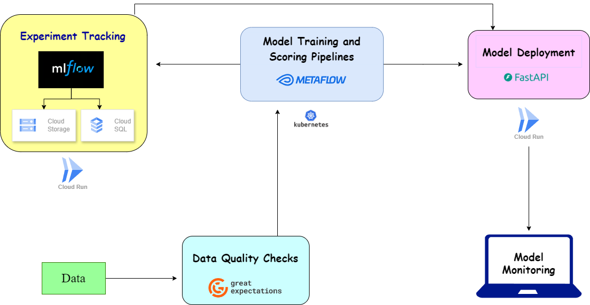

# Project Description
This project demonstrates the development of an end-to-end machine learning pipeline using the [diabetes prediction dataset](https://www.kaggle.com/datasets/iammustafatz/diabetes-prediction-dataset). 
The pipeline incorporates essential stages of the MLOps lifecycle, including experiment tracking, orchestration, ensuring data quality and monitoring model performance
# Dataset Description
The dataset consists of health-related attributes aimed at predicting the presence of diabetes. Each row represents an individual’s health profile, including demographic and clinical factors. The features in the dataset are as follows:

| Feature                | Description                                                  | Data Type         |
|------------------------|--------------------------------------------------------------|--------------------|
| **gender**             | The gender of the individual (e.g., Male, Female)           | Categorical         |
| **age**                | Age of the individual in years                               | Numeric (float)     |
| **hypertension**       | Indicates whether the individual has hypertension (1 = Yes, 0 = No) | Binary              |
| **heart_disease**      | Indicates whether the individual has heart disease (1 = Yes, 0 = No) | Binary              |
| **smoking_history**    | The smoking history of the individual (e.g., never, former, current, No Info) | Categorical         |
| **bmi**                | Body Mass Index (BMI) of the individual                      | Numeric (float)     |
| **HbA1c_level**       | The HbA1c level (percentage) of the individual | Numeric (float)     |
| **blood_glucose_level**| The blood glucose level (mg/dL) of the individual            | Numeric (int)       |
| **diabetes**           | Indicates the presence of diabetes (1 = Yes, 0 = No)        | Binary              |
# MLOPS Stages and Tools

### Key Components

- 🗃️ **Experiment Tracking**: MLflow
  - Track and manage machine learning experiments, parameters, and metrics.
  
- 🛠️ **Orchestration**: Metaflow
  - Manage and execute machine learning workflows with dependency handling and versioning.

- 🔍 **Data Quality Checks**: Great Expectations
  - Validate data integrity and quality with a suite of checks to ensure reliable input for modeling.

- 📦 **Containerization**: Docker
  - Package applications and dependencies into containers for consistent environments.

- 🚀 **Deployment**: FastAPI
  - Serve machine learning models as APIs running on Google Cloud Run for scalability and ease of access.

